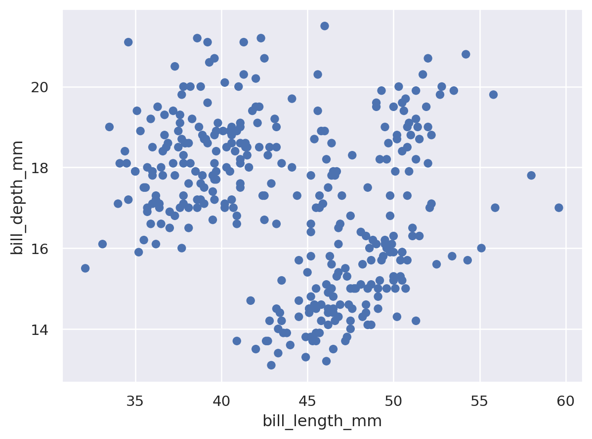
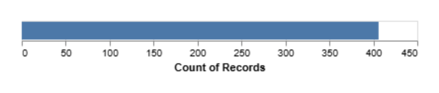

# HW 1 - CS 625, Spring 2025

Insert Your Name Here  
Due: January 26, 2025

## Git, GitHub

*What is the URL of the GitHub repo that you created in your personal account?*
https://github.com/lsott001/HW1
   
*What is pull vs clone in GitHub?*
When you pull you already have access to the repository and is done after you clone to update the code. 
   
*You have committed a change on your local machine/remote. However, you want to undo the changes committed. How would you do that?*
With the git revert command.

## Markdown

*Create a bulleted list with at least 3 items*

<ul>
  <li>Item 1</li>
  <li>Item 2</li>
  <li>Item 3</li>
  <li>Item 4</li>
</ul>

*Write a single paragraph that demonstrates the use of italics, bold, bold italics, code, and includes a link. The paragraph must explain your favorite Olympic sport/game, the country that won the most number of olympic GOLD medals (Summer) in your favorite sport in 2020 (Japan) and 2024 (France). You are free to include more information.*

The <strong>Hammer Throw</strong> is my favorite Olympic sport, blending <em>power, technique, and precision</em> in an incredible display of athleticism. <strong>Poland</strong> excelled in the 2020 Tokyo Olympics, with <strong><em>Wojciech Nowicki</em></strong> winning gold in the men’s event and <strong><em>Anita Włodarczyk claiming</strong></em> her third consecutive gold in the women’s. In the 2024 Paris Olympics, <strong>Canada</strong> made history with <strong><em>Ethan Katzberg</strong></em> winning gold in the men’s event and <strong><em>Camryn Rogers</strong></em> in the women’s. 

*Create a level 3 heading*

<h3>Hammer Throw</h3>

*Insert a image of your favorite Olympics sport/game, sized appropriately*

## Tableau

*Insert the image of your horizontal bar chart here. Reminder, this should show countries that won the least number of medals only (excluding ZERO) in Paris2024 Summer Olynpics by continent (one country from each continent is ok).*

<h2>Error creating tableau account. </h2> 

**

<h3>Working on getting access, awaiting response to email. MTF</h3>**
## Google Colab

*What is the URL of your Google Colab notebook?*

https://colab.research.google.com/drive/1y4exKV-WzsPbh5p2q3wfFobXyV920d4l?usp=sharing

## Python/Seaborn

*Insert the first penguin chart here*

*Describe what the figure is showing.*
<strong>It depicts a scatterplot of the length of penguing bills in mm</strong>
*Insert the second penguin chart here*

*Describe what the figure is showing.*
<strong>It depicts the weight difference between male and female penguins. It also seperates them into their respective type of penguin. </strong>
*What happened when you removed the outer parentheses from the code? Why?*

## Observable and Vega-Lite

*What happens when you replace `markCircle()` with `markSquare()`?*
The data represented by circles turns into squares.

*What happens when you replace `markCircle()` with `markPoint()`?*
The data represented by circles turns into hollow circles.

*What change do you need to make to swap the x and y axes on the scatterplot?*
This:
{ 
vl.x().fieldQ('displ').scale({zero: false}).title("Engine displacement (L)"), 
vl.y().fieldQ('hwy').scale({zero: false}).title("Highway fuel economy (mpg)"),
}
To this:
{
vl.y().fieldQ('displ').scale({zero: false}).title("Engine displacement (L)"), 
vl.x().fieldQ('hwy').scale({zero: false}).title("Highway fuel economy (mpg)"),
}
*Insert the bar chart image here*

*Why do you think this chart is the result of this code change?*
By removing the y-axis encoding for Origin, the chart no longer differentiates data based on the Origin categories along the y-axis. 
## References

*Every report must list the references (including the URL) that you consulted while completing the assignment. Replace the items below with the references you consulted*

* Reference 1, [<https://www.example.com](https://observablehq.com/@observablehq/vega-lite)>](https://observablehq.com/@observablehq/vega-lite)
* Reference 2, [<https://www.example.com/reallyreallyreally-extra-long-URI/>](https://observablehq.com/@oducs-vis/vega-lite-annotations-examples)
